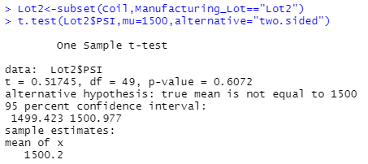

# MechaCar_Statistical_Analysis

## Linear Regression to Predict MPG

**Q1: Which variables/coefficients provided a non-random amount of variance to the mpg values in the dataset?**
   
A1:   Please see screen shot of summary output below, the value of Pr(>|t|) of vehicle length and ground clearance extremely small. In other words, vehicle length and ground clearance have a significant impact on mpg. The intercept is as well as statistically significant, it means that there are other variables and factors that contribute to the variation in mpg that have not been included in our model. These variables may or may not be within our dataset and may still need to be collected or observed.

**Q2: Is the slope of the linear model considered to be zero? Why or why not?**

A2:   The p-value is 5.35-10,which is much smaller than significant level of 0.05%. Therefore, we can state that the slope of the linear model is not zero.

*Q3: Does this linear model predict mpg of MechaCar prototypes effectively? Why or why not?**

A3:   The R-suared value is 0.7149. In the other words, it indicates 71.49% probability that future data will fit the linear model.

## Summary Statistics on Suspension Coils

**Q: The design specifications for the MechaCar suspension coils dictate that the variance of the suspension coils must not exceed 100 pounds per square inch. Does the current manufacturing data meet this design specification for all manufacturing lots in total and each lot individually? Why or why not?

A:   Please see the first screen shot of summary output below, the overall variance is 62.29356 pounds which does not exceed the specification of 100 pounds. Then, please see the second screen shot below. It is summary output by lot group, lot 1 PSI variance is 0.98 pounds, lot 2 PSI variance is 7.47 pounds, and lot 3 PSI variance is 170 pounds. The design specifications is  that the variance of the suspension coils must not exceed 100 pounds per square inch.  lot 1 and lot 2 meets the design specification. On the other hand, lot 3 exceeds 70 pounds than specification standard and fails to meet the specification. 

## T-Tests on Suspension Coils

**Q: Summarize interpretation and findings for the t-test results**

A:   We will use T-test to examine hypothesis below.
 H0: There is no statistical difference between the observed sample mean and its presumed population mean.
Ha: There is a statistical difference between the observed sample mean and its presumed population mean.

Please see the screen shots blow.
1. All manufacturing lot P-value is 0.06028
2. Lot 1 P-value is 1
3. Lot 2 P-value is 0.6072
4. Lot 3 P-value is 0.04168

Only Lot 3 p-value is less than 0.05 so that we would state that mean of Lot 3 is statistically different from the population mean of 1,500 pounds per square inch. The rest of lot p-value is great than 0.05 so that we would state that mean of all manufacturing lot, Lot 1, and Lot 2 are statistically similar with the population mean of 1,500 pounds per square inch.

## Study Design: MechaCar vs Competition

**Q1: What metric or metrics are you going to test?**
A:    I would test the cost and maintenance cost between MechaCar and vehicles from other manufacturers.

**Q2: What is the null hypothesis or alternative hypothesis?**
A:    
     H0: There is no statistical difference between MechaCar’s cost and maintenance cost mean and the competition’s cost and maintenance cost mean.

     Ha: There is a statistical difference between MechaCar’s cost and maintenance cost mean and the competition’s cost and maintenance cost mean.

**Q3: What statistical test would you use to test the hypothesis? And why?**
A:    Use t-test to test the hypothesis to show statistical differences between MechaCar’s cost and maintenance cost mean and the competition’s cost and maintenance cost mean.

**Q4: What data is needed to run the statistical test?**
A:    

